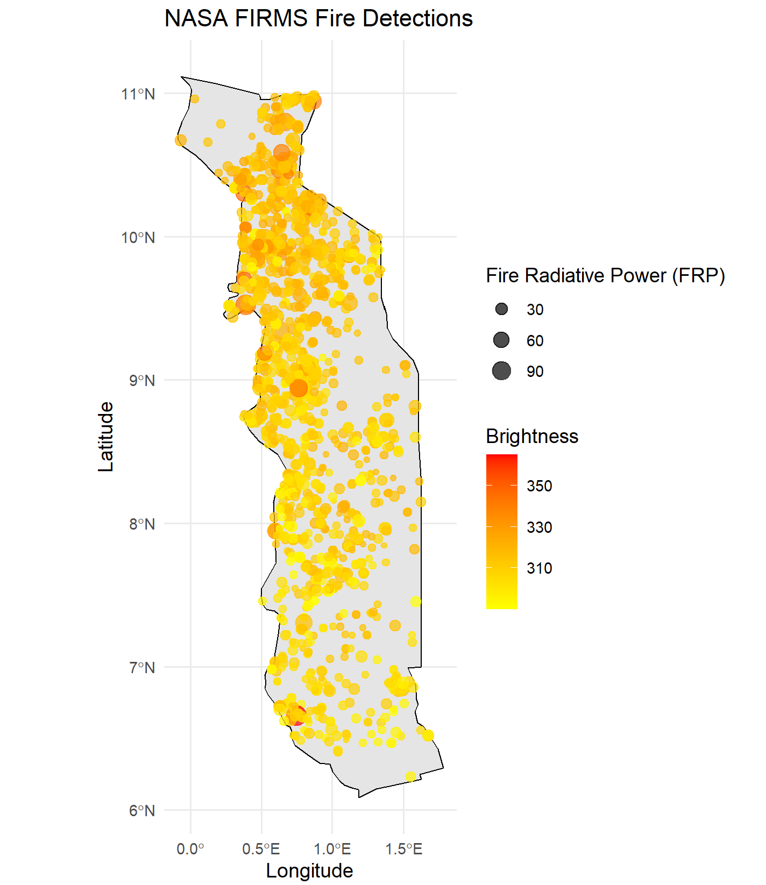
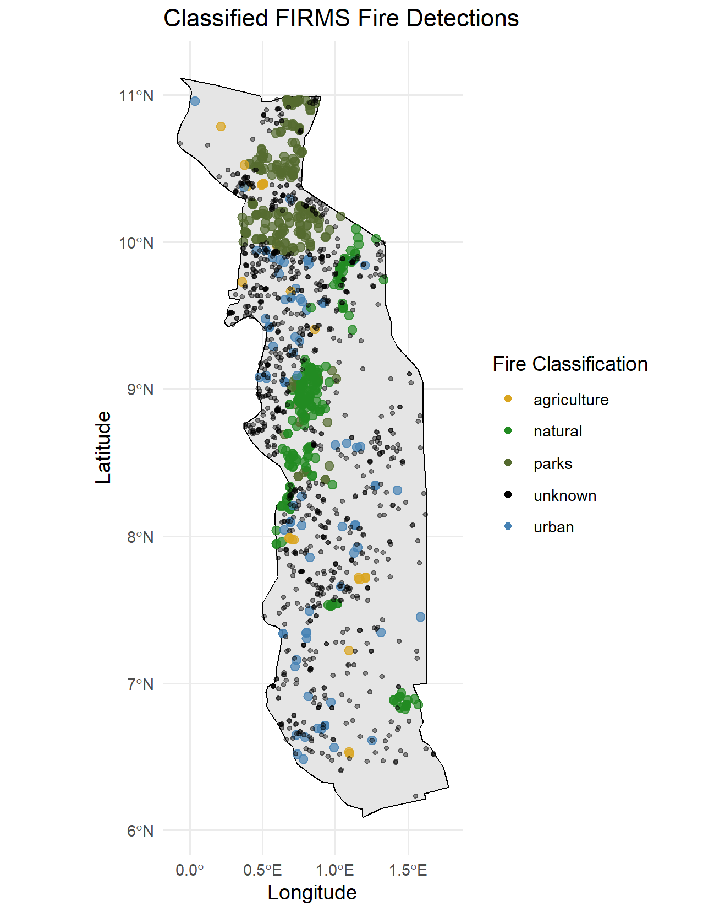
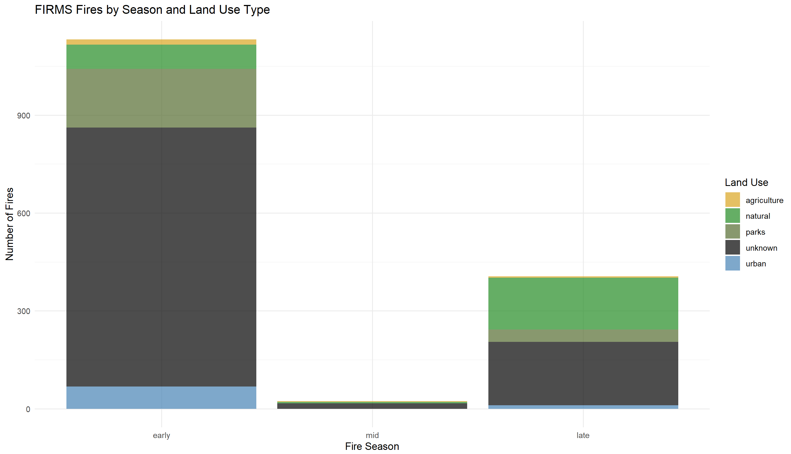
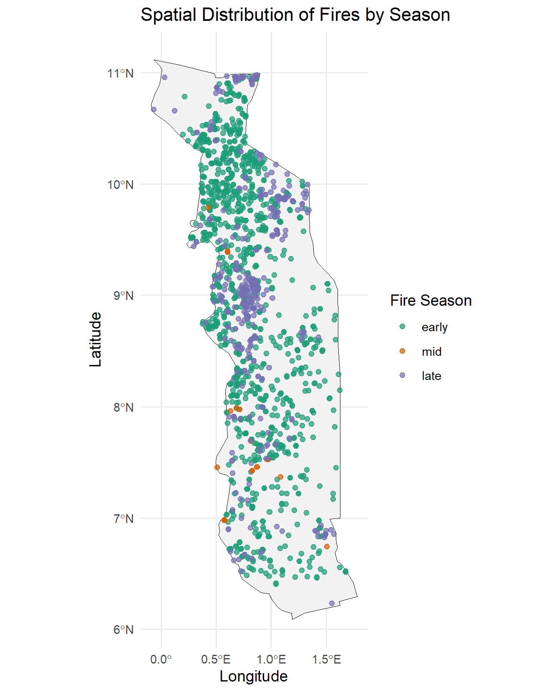
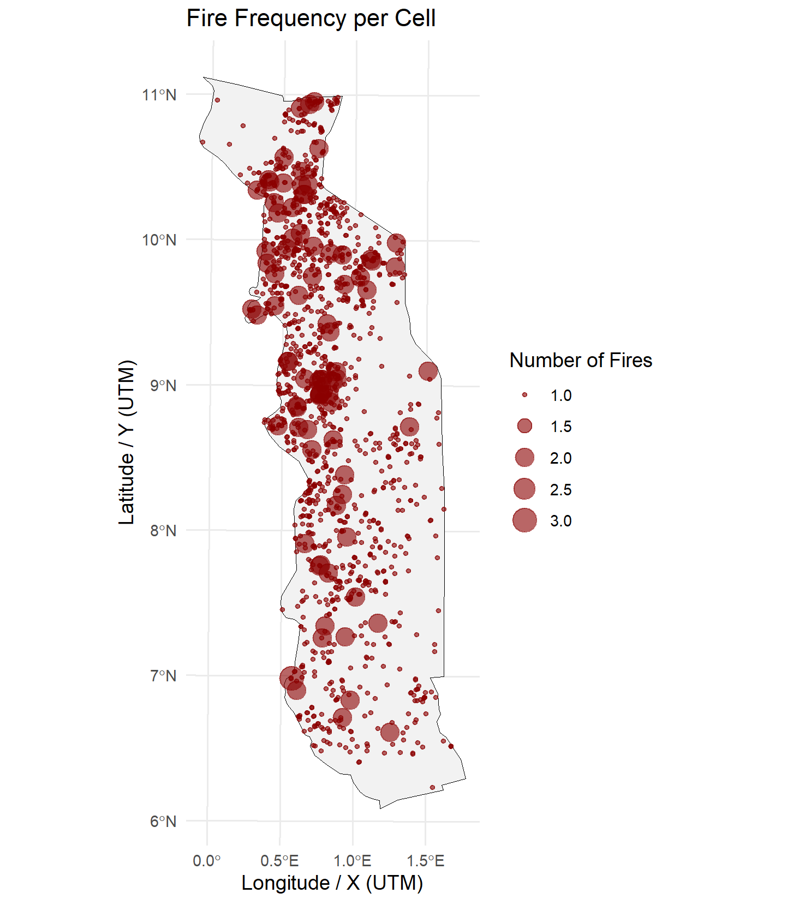

# fiRes: A toolkit for Fire Analysis using FIRMS and OSM data

**fiRes** is an R package that allows users to fetch, classify, visualize, and analyze NASA FIRMS fire data by overlaying it with OpenStreetMap (OSM) land use data. Furthermore, it supports custom fire seasons and spatial fire frequency analysis.

---

## Requirements

- R ≥ 4.0
- NASA FIRMS API key ([get one here](https://firms.modaps.eosdis.nasa.gov/api/))

---

## Function Reference

| Function                  | Description                                                      |
|---------------------------|-----------------------------------------------------------------|
| `fetch_firms_NRT()`       | Download FIRMS NRT data using the NASA API                      |
| `fetch_firms_historic()`       | Download historical FIRMS data using the NASA API          |
| `plot_firms()`            | Visualize raw detections using brightness and FRP               |
| `fetch_osm()`             | Classify fires using OSM land use categories                    |
| `uncategorised_fires()`   | Identify fires not matching any OSM category                    |
| `plot_osm_fires()`        | Visualize categorized fires with a custom basemap               |
| `fire_seasons()`          | Assign fires to user-defined seasonal groups                    |
| `plot_fire_seasons()`     | Create bar and spatial plots of fire season distribution        |
| `fire_frequency()`        | Count fires per spatial cell (e.g., 1km²)                       |
| `plot_fire_frequency()`   | Visualize fire density as scaled points                         |

---

## Installation

```r
# Install the package directly from GitHub
remotes::install_github("HannaZoe/fiRes")

# Load the library
library(fiRes)
```

---

## Example Workflow

### 1. Define Region of Interest
To run the analysis, you must define an Area of Interest (AOI). In this example, we use country borders provided by the `rnaturalearth` package for reproducibility. You can also use your own shapefile. In this example code fires in Togo are explored. Larger AOIs may lead to prolonged loading time when querying OSM data later on.

```r
library(rnaturalearth)

# Access Natural Earth country data at medium resolution for Togo
Togo <- ne_countries(scale = "medium", country = "Togo", returnclass = "sf")

plot(Togo)
```

### 2. Define your NASA FIRMS API key
To query the FIRMS API, you need an API key. [Get one here](https://firms.modaps.eosdis.nasa.gov/api/). NASA Map Keys are free for anyone to use.

```r
api_key <- "your_firms_api_key"
```

### 3. Fetch FIRMS Fire Data

#### 3.1 Fetch Near Real Time (NRT) FIRMS data
The `fetch_firms_NRT()` function retrieves fire detections using the FIRMS API. You must provide a region (AOI) and choose the dataset (`VIIRS_SNPP_NRT`, `VIIRS_NOAA20_NRT` or `MODIS_NRT`). The time frame (`start_date`, `end_date`) of NRT data is limited to the past 10 days. However, MODIS data is often only available for the past 7 days. You can also filter fires by confidence category (`l`, `n`, `h`).

```r
firms_NRT <- fetch_firms_NRT(
  api_key = api_key,
  region_sf = Togo,
  start_date = "2025-04-07",
  end_date = "2025-04-13",
  dataset = "MODIS_NRT",
  confidence_level = c("n", "h")
)

# Inspect the results
print(firms_NRT)
```

#### 3.2 Fetch historic FIRMS data
The `fetch_firms_historic()` function retrieves fire detections using the FIRMS API. The time frame (`start_date`, `end_date`) of archive data depends on the satelite. Loading times depend on the date range. MODIS data is available from 2000, VIIRS SNPP data from 2012 and VIIRS NOAA data from 2018. You must also provide a region (AOI), and choose the dataset (`VIIRS_SNPP_NRT` or `MODIS_NRT`). You can also filter fires by confidence category (`l`, `n`, `h`).

```r
firms_historic <- fetch_firms_historic(
  api_key = api_key,
  region_sf = Togo,
  start_date = "2024-01-01",
  end_date = "2024-12-31",
  dataset = "VIIRS_SNPP_SP",
  confidence_level = c("h")
)

# Inspect the results
print(firms_historic)
```

### 4. Visualize Raw Fire Detections
The `plot_firms()` function displays raw fire points using color scales based on brightness and Fire Radiative Power (FRP). For this example, we are continuing on with the historic FIRMS data.

```r
plot_firms(firms_sf = firms_historic, base_map = Togo)
```



### 5. Classify Fires Using OSM Land Use Data
The `fetch_osm()` function overlays fire detections with OpenStreetMap data to classify them by land use. You can specify which land use types to include and prioritize overlapping ones. Loading times may vary greatly depending on the size of your study area. The fiRes package offers multiple landuse presets. For more details insepct the function using fn + f1 (Help).

```r
firms_classified <- fetch_osm(
  firms_sf = firms_historic,
  feature_types = c("natural", "agriculture", "urban", "parks"),
  priority = c("natural", "parks", "agriculture", "urban")
)
```

### 6. Identify and Reattach Uncategorized Fires
The `uncategorised_fires()` function returns all fire detections not matched to any OSM category. Furthermore, an overview of the number of uncategorized versus classified fires is returned. You can then reattach them to the dataset for full representation.

```r
firms_uncategorised <- uncategorised_fires(
  firms_sf = firms_historic,
  classified_firms_list = list(firms_classified)
)
firms_all <- rbind(firms_classified, firms_uncategorised)

# Inspect results
unique(firms_all$fire_types)
```

### 7. Visualize Classified and Uncategorized Fires
Use `plot_osm_fires()` to display both categorized and uncategorized fire detections on a shared map. Uncategorized fires are plotted as small black dots.

```r
plot_osm_fires(
  firms_list = list(firms_classified),
  firms_uncategorized = firms_uncategorised,
  base_map = Togo
)
```


### 8. Assign Fires to Custom Fire Seasons
The `fire_seasons()` function groups fire detections into custom seasonal definitions based on month of detection.

```r
fire_season_def <- list(early = 1:3, mid = 4:8, late = 9:12)
firms_season <- fire_seasons(firms_all, fire_seasons = fire_season_def)
```

### 9. Plot Fires by Season
Use `plot_fire_seasons()` to generate:
- A bar plot showing seasonal fire counts by land use type
- A map of fire points colored by season

```r
season_plots <- plot_fire_seasons(firms_season, base_map = Togo)
```

#### 9.1 Bar Plot
```r
season_plots$bar_plot
```

#### 9.1 Map Plot
```r
season_plots$map_plot
```


### 10. Calculate Fire Frequency
The `fire_frequency()` function creates a spatial grid and counts how many fire detections occurred in each cell. You can adjust the resolution of the grid, the default is 1km. I choose 0.375km, as this example utilises VIIRS data.

```r
fire_freq <- fire_frequency(firms_all, resolution_km = 0.375)
```

### 11. Plot Fire Frequency
`plot_fire_frequency()` visualizes the result as scaled points where size reflects fire count per cell.

```r
plot_fire_frequency(fire_freq, base_map = Togo)
```

---

## License

MIT License

(c) 2024 Hanna Zoë Schulten

